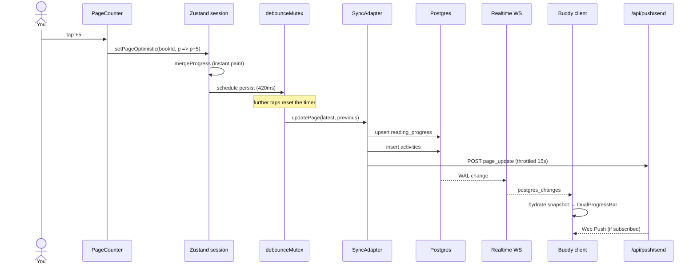
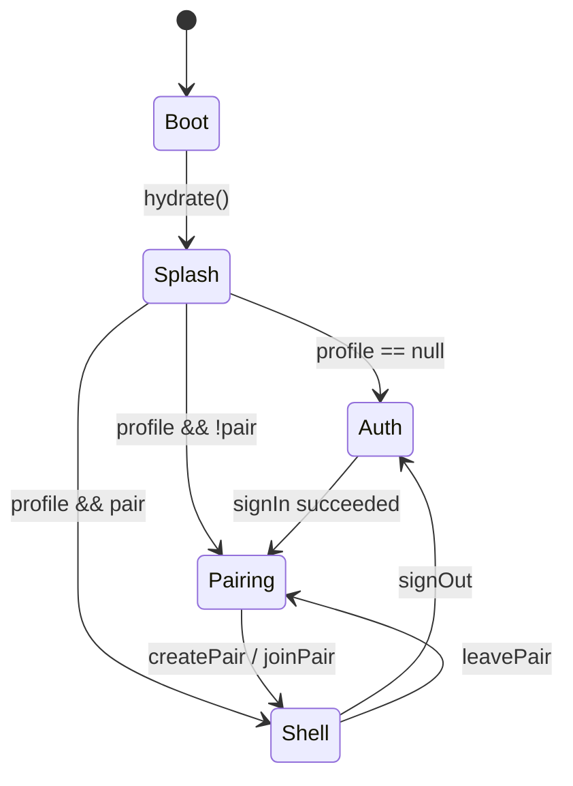
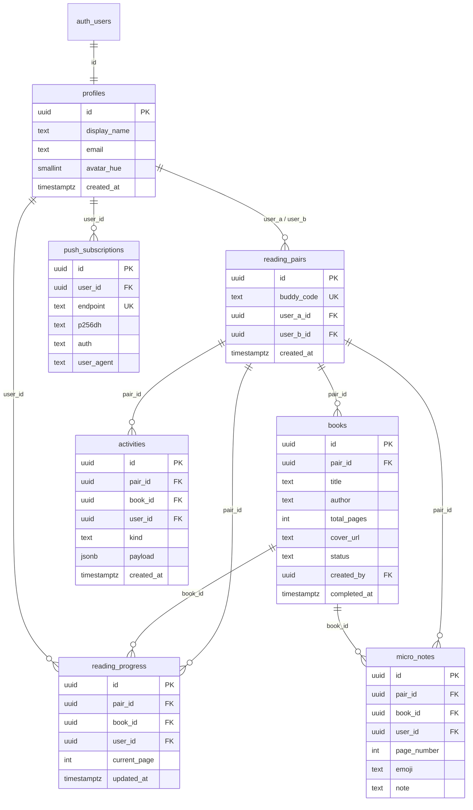

# BookMate — Architecture & Implementation

> A field manual for the engineer who has to own this codebase at 2 a.m.
> Every subsystem below maps 1:1 onto files in this repository. If a sentence
> claims the client does X, you can open the cited file and find the line.

---

## 0. Production vs local (2026)

| Mode | Auth | Data | Host |
| --- | --- | --- | --- |
| **Production** | Supabase Auth | `reading_rooms` + `room_members` (max 5) + shelf tables with `room_id` | Vercel HTTPS |
| **Local demo** | `/api/auth/*` + SQLite | Pair-doc mirror in `pair_docs` (room-shaped in the client) | `npm run dev` |

Apply SQL: `supabase/migrations/0001_init.sql` then `0002_rooms.sql`.
Deploy steps: [`docs/VERCEL_DEPLOY.md`](./VERCEL_DEPLOY.md).

Rooms API on the store: `createRoom`, `joinRoom`, `leaveRoom`, `deleteRoom`, `kickMember`, `setActiveRoom`.
Empty shelf on create (no sample seed). Share fallback: `ShareLinkModal`.

Older sections below still mention `reading_pairs` / `pair_id` historically; **cloud schema after `0002` uses rooms.**

---

## Table of contents

1. [System architecture & data flow](#1-system-architecture--data-flow)
2. [PostgreSQL schema](#2-postgresql-schema)
3. [Real-time engine & optimistic sync](#3-real-time-engine--optimistic-sync)
4. [Web Push notification engineering & the iOS challenge](#4-web-push-notification-engineering--the-ios-challenge)
5. [Service worker lifecycle](#5-service-worker-lifecycle)
6. [PWA lifecycle & UX engineering](#6-pwa-lifecycle--ux-engineering)
7. [Edge cases, race conditions & solutions](#7-edge-cases-race-conditions--solutions)
8. [PDF generation utility](#8-pdf-generation-utility)
9. [Local development & deployment](#9-local-development--deployment)
10. [Source map (where to look)](#10-source-map-where-to-look)

---

## 1. System architecture & data flow

BookMate is a **Progressive Web App** with a thin Next.js App Router shell, a
client-owned session store, and a **pluggable sync adapter**.

```
┌──────────────────────────────────────────────────────────────────────────┐
│  Browser (standalone PWA or Safari/Chrome tab)                           │
│                                                                          │
│  App Router pages  ──►  AppShell + AuthGate                              │
│                              │                                           │
│                              ▼                                           │
│                     Zustand session store                                │
│                     (optimistic UI source of truth)                      │
│                              │                                           │
│              ┌───────────────┴────────────────┐                          │
│              ▼                                ▼                          │
│     LocalAdapter                      SupabaseAdapter                    │
│     sessionStorage user               auth.users + RLS                   │
│     localStorage pair data            postgres + realtime                │
│     BroadcastChannel                  web-push via /api/push/send        │
│                                                                          │
│  public/sw.js  ◄── registerServiceWorker()  ◄── AppProviders             │
│       │                                                                  │
│       ├─ Cache (BookMate-v3)                                             │
│       ├─ push / notificationclick                                        │
│       └─ SKIP_WAITING ◄── usePWAUpdate                                   │
└──────────────────────────────────────────────────────────────────────────┘
              │                                        │
              │  HTTPS + WebSocket                     │  Web Push (VAPID)
              ▼                                        ▼
     ┌─────────────────┐                     ┌──────────────────┐
     │ Supabase        │                     │ Push services    │
     │  Auth           │                     │  FCM / Mozilla   │
     │  Postgres       │                     │  Apple web push  │
     │  Realtime       │                     └──────────────────┘
     └─────────────────┘
```

### 1.1 Why an adapter instead of “just call Supabase”?

The product has to be **demoable without credentials** and **production-ready
with a pair of env vars**. `lib/store/session-store.ts` never imports Postgres.
It talks to `SyncAdapter` (`lib/sync/types.ts`):

| Method | Local demo | Supabase production |
| --- | --- | --- |
| `hydrate` | `sessionStorage` user id + `localStorage` pair blob | `auth.getUser` + joined selects |
| `updatePage` | mutate pair blob, `BroadcastChannel` | upsert `reading_progress`, insert `activities` |
| `subscribe` | `BroadcastChannel('BookMate-sync')` | `postgres_changes` on 5 tables |
| `savePushSubscription` | stored on the pair blob | upsert `push_subscriptions` |

`getAdapter()` in the session store picks Supabase when
`NEXT_PUBLIC_SUPABASE_URL` **and** `NEXT_PUBLIC_SUPABASE_ANON_KEY` are set,
otherwise Local. That decision is made once per page load — do not hot-swap
adapters mid-session.

### 1.2 Request path of a page turn (happy path, both users online)



### 1.3 Auth & pairing state machine



`components/auth/AuthGate.tsx` is the only gate. Authenticated routes are not
protected by Next.js middleware; this is a client-owned PWA. Deep links such as
`/book/[id]` still render `AppShell`, which re-runs the gate. Unauthenticated
users never see the bottom nav.

### 1.4 Pairing: Buddy Code + per-book share

`generateBuddyCode()` in `lib/utils.ts` draws 6 characters from
`ABCDEFGHJKLMNPQRSTUVWXYZ23456789` (32 glyphs, no `0/O/1/I`). Entropy is
`32^6 ≈ 1.07e9`. Collisions are rejected by the unique index
`reading_pairs_buddy_code_uidx`.

**Share a book, not the account.** `lib/invite.ts` builds
`/join/{buddyCode}?book={bookId}`. Home, Library, and book detail expose
`ShareBookButton`. Settings only shows the code; it does not send an
account-wide invite.

**Local demo (two tabs, one origin):**

- Identity lives in **`sessionStorage`** (`BookMate-session-user-id`) so each
  tab is a different person.
- Shared pair documents live in **`localStorage`** keyed by pair id
  (`BookMate-pair-data:<uuid>`).
- Fan-out is `BroadcastChannel('BookMate-sync')` for **tabs in the same
  browser profile**. Incognito is a different profile, so it cannot see that
  channel or that `localStorage`.
- The local adapter **PUTs** the pair to `app/api/pairs/[code]`
  (SQLite `pair_docs` in gitignored `.data/pagemate.db`). The other browser **subscribes to SSE**
  (`GET /api/pairs/[code]/stream`) and receives pushes when PUT merges.
  PUTs **merge** (`lib/sync/merge-pair.ts`) so a host
  page-turn cannot wipe `userBId` or rewind the buddy’s page. Two phones
  still need **Supabase** unless they hit this same Next host.

**Production:** `user_a` inserts a row; `user_b` looks up `buddy_code`, then
`update user_b_id`. RLS allows an authenticated user to `select` a pair that
still has `user_b_id is null` so join-by-code works without a prior membership.

---

## 2. PostgreSQL schema

Canonical SQL: `supabase/migrations/0001_init.sql`.

Auth identities are **`auth.users`**. The public “users” table the product
talks about is **`public.profiles`**, 1:1 with `auth.users(id)` via FK
`on delete cascade`. A trigger `on_auth_user_created` copies `display_name`
out of `raw_user_meta_data` the moment a magic-link user is created, so the
client does not race an empty profile.



### 2.1 Why `pair_id` is denormalized onto progress / notes / activities

Realtime `postgres_changes` filters and RLS both need a cheap “is this row in
my pair?” test. Joining `books` on every policy evaluation is correct but
slow and awkward in `CREATE POLICY`. `public.is_pair_member(pair_id)` is a
`STABLE` SQL function used by four tables.

### 2.2 Indexes (and why each exists)

| Index | Purpose |
| --- | --- |
| `reading_pairs_buddy_code_uidx` | Join-by-code + generator retry |
| `reading_pairs_user_a_idx` / `_user_b_idx` | “What pair am I in?” |
| `books_pair_status_idx` | Library tabs |
| `reading_progress (book_id, user_id) UNIQUE` | Upsert target for page turns |
| `reading_progress_updated_idx` | Last-write inspection / debug |
| `activities_pair_created_idx` | Feed `order by created_at desc` |
| `micro_notes_book_idx` | Notes on a page of a book |
| `push_subscriptions.endpoint UNIQUE` | Browser subscription is global; upsert on resubscribe |
| `push_subscriptions_user_idx` | “All devices of the buddy” at send time |

### 2.3 Foreign keys & delete behavior

- Deleting a **pair** (`user_a` leaves) **cascades** books, progress, activity,
  notes. That is intentional: a pair is the tenancy boundary.
- `user_b` leaving **sets `user_b_id` null**; pair data remains for `user_a`.
- `push_subscriptions` cascade when a profile is deleted (account removal).
- `activities.book_id` is `on delete set null` so a deleted book does not
  punch holes in the timeline — the payload JSON still has `bookTitle`.

### 2.4 RLS in one paragraph

You may read/write a book, a progress row, a note, or an activity **only if
you are `user_a` or `user_b` of that `pair_id`**. You may read a partner
profile only if you share a pair. You may read/write **your own** push
endpoints. Open pairs (`user_b_id is null`) are selectable by any signed-in
user so join-by-code works; buddy codes are unguessable enough for two friends.
A tighter design would be a `SECURITY DEFINER` `join_pair(code)` function —
worth doing if this ever leaves the “two friends” threat model.

### 2.5 Realtime publication

The migration adds five tables to `supabase_realtime`. The client channel is
named `BookMate-realtime` and listens for `event: "*"` on
`reading_progress`, `activities`, `micro_notes`, `books`, `reading_pairs`.
On **any** of those events the adapter refetches the whole snapshot
(`fetchSnapshot`). That is deliberately simple: the working set for one pair
is tiny (one shelf, two progress rows per book, ≤200 activities). Do not
micro-patch individual rows until you have a reason.

---

## 3. Real-time engine & optimistic sync

Three layers, always in this order:

1. **Paint** the new page in Zustand (`mergeProgress`).
2. **Collapse** bursts with `debounceMutex` (`lib/sync/mutex.ts`).
3. **Persist** via the adapter; **reconcile** from Realtime/BroadcastChannel.

### 3.1 Optimistic state (`setPageOptimistic`)

File: `lib/store/session-store.ts`.

```
current = progress[(bookId, me)] ?? 0
next    = clamp(pageOrFn(current), 0, totalPages)
if next == current: return
set({ progress: mergeProgress(...) })   // UI updates this frame
haptic("selection")                     // navigator.vibrate
debounceMutex(`page:${bookId}:${me}`, persistLatest, 420ms)
```

The debounce **key includes user id**. Two readers on the same book do not
share a timer. The **value** persisted is not the page at tap-time; the mutex
callback re-reads `get().progress`. Ten taps of `+1` become **one** upsert of
`current+10`.

`previousPage` passed to `updatePage` is the page **before this burst**, used
only for the activity delta (`+10`), not for conflict detection.

### 3.2 Debounce + mutex (rapid page turns)

File: `lib/sync/mutex.ts`.

**Debounce:** `timers` is a `Map<string, Timeout>`. Every call `clearTimeout`s
the previous handle. Only the last call in a 420ms quiet window fires.

**Mutex:** `tails` is a `Map<string, Promise<void>>`. When the timer fires:

```
prev = tails.get(key) ?? Promise.resolve()
next = prev.catch(() => undefined).then(fn)
tails.set(key, next)
```

If a network write is still in flight when the next burst’s timer fires, the
new write **waits**. Combined with “read latest page from the store”, this is
last-write-wins **per user**, which is the correct model (a reader has one
finger). It is **not** last-write-wins across the pair: each user has their
own `(book_id, user_id)` row.

There is no true distributed lock. Postgres unique `(book_id, user_id)` plus
upsert is the serialization point. If two devices of the **same** user race
(phone + tablet), the later `updated_at` wins visually after Realtime
refetch. Acceptable for v1.

### 3.3 What the partner actually receives

**Supabase:** the writing client’s `updatePage` upserts. Logical replication
emits a `postgres_changes` payload. The partner’s `subscribe` handler ignores
the payload body and calls `fetchSnapshot`. DualProgressBar’s `motion.div`
animates `width` to the new percent. LeadIndicator’s React `key={copy}`
re-mounts the sentence (“Mahdi is 12 pages ahead!”).

**Local:** `writePairData` then `channel.postMessage({ type: "invalidate" })`.
The other tab’s `onmessage` calls `assemble(sessionUserId())` and pushes the
snapshot into every Zustand subscriber. Same UI path.

Self-echo: the writer also `emit()`s / `notify()`s. Zustand `set` with the
same page is a no-visual-op (Framer Motion `initial={false}`).

### 3.4 Activity feed

Every persisted page turn inserts `activities.kind = 'page_update'` with
`payload: { page, previousPage, delta, bookTitle }`. The feed is **not**
derived from progress rows so that a later overwrite does not rewrite
history. Cap is 200 rows client-side; there is no server-side eviction yet.

### 3.5 Completion / confetti

After persist, the store checks **both** progress rows `>= totalPages`. If so
it calls `fireCompletionConfetti()` (`canvas-confetti`, indigo + amber + cream)
and `haptic("success")`. The adapter independently marks `books.status =
'completed'` when both rows are done so a partner who never taps still
transitions the library card.

---

## 4. Web Push notification engineering & the iOS challenge

Local demo (no Supabase): `/api/push/send` reads buddy subscriptions from
`.data/pairs.json` (`pushSubscriptions` on the pair doc). The local adapter
POSTs `{ buddyCode, actorId, event }` after a page turn or note. Settings
**Send test ping** targets this device. iOS still requires Home Screen /
standalone.

### 4.1 VAPID cryptography (what the keys actually are)

Web Push authorization uses **Voluntary Application Server Identification**
([RFC 8292](https://datatracker.ietf.org/doc/html/rfc8292)).

You generate an **ECDSA P-256** key pair (`npm run vapid` →
`web-push.generateVAPIDKeys()`):

- **Public key** (`NEXT_PUBLIC_VAPID_PUBLIC_KEY`): 65-byte uncompressed point,
  URL-safe base64. The **browser** gets this as `applicationServerKey` in
  `pushManager.subscribe`. It is not secret. It identifies *this* app to the
  push service so only holders of the matching private key can send.
- **Private key** (`VAPID_PRIVATE_KEY`): server only. `web-push` uses it to
  sign a JWT (`aud` = origin of the endpoint, `exp` ≤ 24h, `sub` =
  `VAPID_SUBJECT` mailto/URL). The push service (FCM, Mozilla, Apple) verifies
  the JWT before forwarding the payload to the device.

The subscription object has three parts you **must** persist:

| Field | Meaning |
| --- | --- |
| `endpoint` | HTTPS URL of that browser’s push mailbox |
| `keys.p256dh` | Client ECDH public key (payload encryption, RFC 8291) |
| `keys.auth` | 16-byte auth secret (HKDF salt) |

`urlBase64ToUint8Array` (`lib/pwa/vapid.ts`) reverses the URL-safe base64
the browser wants: pad to multiple of 4, map `-`/`_` back to `+` `/`,
`atob`, bytes. Chrome will **reject** subscribe if this conversion is wrong
(classic off-by-one padding bug).

Payload encryption is **not** your job if you use the `web-push` npm package:
it does aes128gcm encoding for you. The service worker receives already
decrypted bytes in `event.data`.

### 4.2 Client subscription flow

Hook: `hooks/usePushNotifications.ts`.

1. Feature-detect `serviceWorker`, `PushManager`, `Notification`.
2. On first pairing, if permission is `default` and
   `BookMate-push-prompt-seen` is unset, open `PushPrompt` after 1.8s.
3. `Notification.requestPermission()` — must run in a **user-gesture** stack
   (the Enable button). Silent `subscribe()` from `useEffect` will fail on
   Safari.
4. `navigator.serviceWorker.ready` then
   `reg.pushManager.subscribe({ userVisibleOnly: true, applicationServerKey })`.
   `userVisibleOnly: true` is **required**; silent push is not allowed for web.
5. `subscription.toJSON()` → `{ endpoint, keys.p256dh, keys.auth }` stored
   via `savePushSubscription` next to the user (and, in local mode, on the
   pair blob).
6. Settings toggle calls `unsubscribe()` + `removePushSubscription(endpoint)`.

### 4.3 Server send path

Route: `app/api/push/send/route.ts` (`runtime = "nodejs"` — `web-push` is not
Edge-compatible).

1. `webpush.setVapidDetails(subject, publicKey, privateKey)`.
2. Actor id from `Authorization: Bearer <access_token>` via
   `supabase.auth.getUser(token)`. No token → 401. This prevents random
   clients from paging someone else’s phone.
3. **Throttle** `Map<`${actor}:${event}:${bookId}`, ts>` at 15 seconds
   (`PUSH_THROTTLE_MS`). Rapid `+1` spam must not wake a sleeping buddy 40
   times. In-memory map is per-server-instance; good enough for a single
   Node/Vercel lambda with warm reuse, not a guarantee across cold starts.
4. Resolve pair → buddy id. No buddy → `{ skipped: "no_buddy" }`.
5. Load **all** `push_subscriptions` for the buddy (phone + desktop).
6. `webpush.sendNotification(subscription, payloadJSON)` in
   `Promise.allSettled`.
7. HTTP **410 Gone** from the push service means the endpoint is dead
   (user cleared site data, iOS evicted the token). Delete those rows so we
   stop retrying poison endpoints.

The Supabase adapter calls this after `updatePage` and `addNote`, forwarding
the session access token (`sendPush` helper). Local adapter does **not** call
it — there is no second device in pure local mode.

Payload shape the SW expects:

```json
{
  "title": "BookMate",
  "body": "🔥 Mahdi just reached page 150 of 'Clean Architecture'! Catch up!",
  "bookId": "<uuid>",
  "url": "/book/<uuid>",
  "tag": "BookMate-<uuid>"
}
```

`tag` + `renotify: true` collapse multiple updates to the same book into one
notification slot.

### 4.4 The iOS Safari challenge (read this twice)

Apple shipped **Web Push in Safari 16.4+** with constraints that do not exist
on Android Chrome. Ignoring them produces “it works on my Pixel, dead on her
iPhone.”

**1. Home Screen only (standalone).**  
iOS will not deliver web push to a page sitting in a Safari tab. The app
**must** be added to the Home Screen (`display-mode: standalone` /
`navigator.standalone === true`). That is why `InstallPrompt` on iOS is not
a nice-to-have — it is a functional requirement for notifications. The iOS
guide walks Share → Add to Home Screen because there is **no**
`beforeinstallprompt` on iOS.

**2. User gesture for permission.**  
`Notification.requestPermission()` from an auto-opened modal is unreliable.
The prompt’s primary button is the gesture. After a denial, iOS will not
ask again; Settings → BookMate is the only recovery. Surface that in the
Settings toggle error string.

**3. Visible notification required.**  
`userVisibleOnly` is mandatory. A `push` event **must** call
`showNotification` (we always do). If you skip it, iOS revokes the
subscription.

**4. Token / endpoint renewal.**  
iOS may rotate the push endpoint after OS updates or “offload unused apps.”
On every launch we `getSubscription()`; if it exists we upsert (unique
`endpoint` handles the new URL as a new row; old 410s get swept on send).
There is no Apple-provided refresh token API. Treat 410 as the refresh
signal.

**5. Service worker longevity.**  
iOS can kill idle workers aggressively. Push **wakes** the worker; that is
the only guaranteed execution window. Do not assume IndexedDB writes in
`push` will finish unless they are inside `event.waitUntil(...)`. We only
`showNotification` there — keep that path tiny.

**6. Focus vs. open.**  
`notificationclick` tries `clients.matchAll({ type: "window" })` and
`client.focus()` + `client.navigate(url)`. `navigate()` on `WindowClient` is
spotty on iOS; falling back to `openWindow(target)` is required. Target is
`/book/[id]` so a page-turn ping lands on the book, not the dashboard.

**7. Badge & vibration.**  
`badge: /icons/badge-72.png` is Android/Chrome. iOS ignores vibration
patterns and often ignores badges. Do not build UX that depends on them.

**8. Payload size.**  
Apple’s web push payload limit is small (~4KB). Our JSON is a sentence.
Never put book text in the push body.

### 4.5 Permissions UX map

| Platform | Install needed for push? | `beforeinstallprompt` | Permission prompt |
| --- | --- | --- | --- |
| Android Chrome | No, but install helps retention | Yes | Gesture recommended |
| Desktop Chrome/Edge | No | Yes | Gesture recommended |
| iOS Safari tab | **Yes (Home Screen)** | No | Will fail / no delivery |
| iOS Home Screen PWA | Already installed | No | Gesture required, 16.4+ |
| Firefox Android | No | Sometimes | Gesture recommended |
| Desktop Safari 16+ | No (macOS) | No | Gesture required |

---

## 5. Service worker lifecycle

File: `public/sw.js`. Registered from `lib/pwa/register-sw.ts` as
`navigator.serviceWorker.register("/sw.js", { scope: "/" })`. Next.js is told
not to cache the script (`Cache-Control: no-store` + `Service-Worker-Allowed: /`
in `next.config.ts`).

### 5.1 `install`

```js
self.addEventListener("install", (event) => {
  event.waitUntil(
    caches.open("BookMate-v3").then((cache) => cache.addAll(PRECACHE))
  );
});
```

`PRECACHE` is the offline shell: `/offline`, `/offline.html`, manifest,
icons. `/` is **not** precached — pinning the homepage kept a stale auth bundle
after VPS deploys. `skipWaiting()` is **not** called here. A new worker that auto-activates
would yank the rug out from an open reading session. Activation waits for
`SKIP_WAITING` from the Update toast, from `registerServiceWorker()` when a
waiting worker exists, **or** for all clients to close.

`cache.addAll` is wrapped in `.catch(() => undefined)` so a single 404 during
install (e.g. icons not generated yet) does not fail the whole worker.

### 5.2 `activate`

Deletes every cache whose name is not `BookMate-v3`. Bump `CACHE_VERSION` when
you change precache contents or fetch strategy. Then `self.clients.claim()` so
the new worker controls pages that were loaded under the old one — but only
after it became the active worker (which is after skipWaiting or reload).

### 5.3 `message` / `SKIP_WAITING`

```js
self.addEventListener("message", (event) => {
  if (event.data?.type === "SKIP_WAITING") self.skipWaiting();
});
```

The waiting worker receives this from `usePWAUpdate.applyUpdate`. `skipWaiting`
promotes it to active → `activate` fires → `controllerchange` on the page →
the hook reloads. See §6.2.

### 5.4 `fetch` strategies

| Request | Strategy | Why |
| --- | --- | --- |
| `POST` / non-GET | ignored | never cache mutations |
| cross-origin | ignored | don’t cache Open Library / Supabase |
| `/api/*` | ignored | push + search must be live |
| `mode === "navigate"` | **network-first**, fallback `/offline` then `/offline.html` | HTML can change every deploy |
| `/_next/static/*`, `/icons/*`, manifest | **cache-first** | content-hashed or tiny |
| everything else same-origin GET | **stale-while-revalidate** | CSS/fonts |

Network-first for navigations is the difference between “users stuck on a
broken dashboard after deploy” and “users see the new JS on next visit.”
Offline fallback is a real HTML document (not a fetch error) so iOS still
paints something.

### 5.5 `push`

Parse JSON (fallback to text). `showNotification` with icon, badge, vibration
`[80, 40, 80, 40, 120]`, `data.url`, two actions (`open` / `later`). Wrapped
in `event.waitUntil` so iOS/Android keep the worker alive until the banner is
queued.

### 5.6 `notificationclick`

Close the banner. Ignore `later`. Prefer focusing an existing window and
navigating it to `/book/[id]`; else `openWindow`.

### 5.7 Cache invalidation policy

There is **no** runtime message to purge. Invalidation is:

1. Version bump of `CACHE_VERSION` → activate deletes old caches.
2. Navigation network-first overwrites HTML entries when online.
3. Hashed `/_next/static/` files are new URLs per build; old hashes rot until
   activate. Precache does not include those hashes (they change), so the first
   visit after deploy relies on network.

Do not precache `/_next/static/chunks/*` from a build you cannot name at SW
authoring time unless you generate the worker at compile time (Workbox/Serwist).
This project’s SW is hand-written and deploy-stable.

---

## 6. PWA lifecycle & UX engineering

### 6.1 `usePWAInstall.ts` — line-by-line

**Types.** `InstallPlatform` is `"android" | "ios" | "desktop" | "standalone" | "unknown"`.
`BeforeInstallPromptEvent` extends `Event` with `prompt()` and `userChoice`.
Chromium-only; TypeScript does not ship this.

**`daysSince` / `readDismissed`.** Dismissal is a timestamp in `localStorage`,
not a boolean. `INSTALL_DISMISS_DAYS` is 14 (`lib/config.ts`). After two weeks
the banner may return. Keys: `BookMate-install-dismissed-at` (Android/desktop)
and `BookMate-ios-install-dismissed-at` (iOS). Split keys so dismissing the
Chromium sheet does not suppress the iOS tutorial if they later open Safari.

**`detectPlatform`.**

1. `matchMedia('(display-mode: standalone)')` **or** `fullscreen` **or**
   `navigator.standalone` (legacy iOS). If true → `"standalone"` and we never
   nag.
2. UA `/iPad|iPhone|iPod/` **or** the iPad-OS-on-desktop lie
   (`MacIntel` + `maxTouchPoints > 1`) → `"ios"`.
3. `/Android/` → `"android"`.
4. Else `"desktop"`.

**Effect on mount.**

- Capture `beforeinstallprompt`, **`preventDefault()`**, stash the event in
  React state. If not dismissed, `setVisible(true)`. Without `preventDefault`
  Chrome shows its mini-infobar and we lose the event.
- Listen `appinstalled` → mark installed, clear deferred event.
- On iOS (no BIP event), delay 1400ms then show the Share-sheet tutorial,
  unless dismissed.

**`dismiss`.** Writes `Date.now()` to the platform-appropriate key, hides UI.

**`promptInstall`.** Guards on `deferred`. `await deferred.prompt()` — this is
the call that opens the native mini-dialog. `userChoice` resolves
`accepted | dismissed`. Accepted → `installed`. Dismissed → our `dismiss()`
so we don’t immediately re-open. Then drop `deferred` (the event is
one-shot; you cannot `prompt()` twice).

**Return surface.** `canNativePrompt` is true only when we have a stashed BIP
**and** platform is android/desktop. `showIosGuide` is iOS + visible + not
installed. Settings “Install BookMate” calls `promptInstall` or `open()`
accordingly.

**UI.** `components/pwa/InstallPrompt.tsx` is a glass bottom sheet. iOS gets
three numbered rows (Share, scroll, Add to Home Screen). Android/desktop get
one primary button.

### 6.2 `usePWAUpdate.ts` — line-by-line

**State.** `registration`, `waitingWorker`, `updateReady`.

**Effect.**

- Bail if no `serviceWorker`.
- `getRegistration().then(attach)`.
- `attach(reg)`: if `reg.waiting` already (user sat on an old tab while a
  new worker installed), flip `updateReady`.
- `reg.addEventListener("updatefound")` → grab `reg.installing`, listen
  `statechange`. When `state === "installed"` **and**
  `navigator.serviceWorker.controller` is set, this is an **update**, not the
  first install. (First install has `controller === null`.) Then set
  `waitingWorker` and `updateReady`.
- Listen `controllerchange` → `window.location.reload()`. This fires after
  `skipWaiting` + activate. Reloading here, not in `applyUpdate` directly,
  avoids racing the new controller.

**`applyUpdate`.**

```
worker = waitingWorker ?? registration?.waiting
if (!worker) location.reload()
else worker.postMessage({ type: "SKIP_WAITING" })
```

The SW handles `SKIP_WAITING` (§5.3). We do **not** reload in `applyUpdate`;
we wait for `controllerchange` so the new worker is definitely controlling
the page. If we reloaded first, we might request HTML under the old worker.

**`dismiss`.** Hides the toast without skipping waiting. The worker stays
waiting; the next visit (or next `updatefound`) can offer again.

**UI.** `components/pwa/UpdateToast.tsx` — floating glass bar above the
bottom nav, copy: “Update available / A newer version of BookMate is ready.”
Primary: **Update & Restart**.

### 6.3 `display-mode: standalone`

`manifest.json` sets `"display": "standalone"`, `theme_color` and
`background_color` `#0F172A`, `start_url` `/`, `scope` `/`. Layout viewport
uses `viewportFit: "cover"` and `themeColor: #0F172A`. Bottom nav padding is
`env(safe-area-inset-bottom)` so the iPhone home indicator does not eat
tabs. `apple-mobile-web-app-capable` is set both via Next `metadata.appleWebApp`
and a raw meta tag — iOS is inconsistent about which it honors.

When `detectPlatform()` returns `standalone`, install UI is suppressed and
Settings says “Running as an installed app.”

### 6.4 Registration timing

`AppProviders` calls `registerServiceWorker()` once on mount **and**
`reg.update()` immediately. That makes `updatefound` fire on each launch if
`sw.js` bytes changed (we send `Cache-Control: no-store` for `/sw.js` so
Chrome actually revalidates).

---

## 7. Edge cases, race conditions & solutions

### 7.1 Rapid multi-page turns

**Symptom:** User mashes `+1`. Naïve impl would fire 12 upserts; Realtime
would animate 12 times; push would fire 12 notifications.

**Solution:** optimistic merge every tap; `debounceMutex` 420ms; persist
**latest** page; push throttle 15s per `(actor, event, book)`.

### 7.2 Two devices, same user

**Symptom:** Phone at page 40, tablet at 42, both go online.

**Solution:** last upsert wins (`updated_at` is wall clock). No CRDT. The
product assumption is one human, one finger. If you need multi-device
merge, store a vector clock or “max page only goes forward” rule
(`current_page = greatest(current_page, excluded.current_page)` in the
upsert). Not implemented; pages can theoretically jump backward if an
offline tablet replays an older queue item. Mitigation: replay uses the
queued page as an absolute set, so **replay order** matters — see 7.3.

### 7.3 Offline mutation queue

Files: `lib/offline/queue.ts`, `replayOfflineQueue` in the store.

Queue items are `{ id, type, createdAt, payload }` in **IndexedDB** via
`idb-keyval` (`BookMate-offline-queue`), mirrored to `localStorage`
(`BookMate-offline-queue-ls`) because Safari private mode throws on IDB.

On `setPageOptimistic`, if `navigator.onLine === false`, enqueue
`update_page` and toast “Saved offline.” `useRealtimeProgress` listens
`window.online` and calls `replayOfflineQueue`. Hydrate also replays.

Replay is **strictly serial**. A failed item `break`s the loop so we don’t
drop a later note while an earlier page turn is still erroring. Successful
items `dequeueMutation(id)`.

**Forward-only caveat:** if the user went offline at page 40, queued 41, 42,
43, we persist three items unless debounce already collapsed them. Debounce
still runs offline (timer is local), so typically **one** queued mutation
with the latest page. If the app is killed mid-burst before the timer
fires, you can lose the tail of the burst — the optimistic Zustand persist
is **not** itself durable except via the queue. Improvement: persist the
optimistic snapshot to `sessionStorage` on every tap (not done in v1).

### 7.4 Partner update during my debounce window

I am at 100, buddy is at 100. I tap +5 (optimistic 105) but have not
persisted. Buddy’s Realtime event refetches snapshot showing me still at
100 and **overwrites Zustand**, wiping 105.

**This is real.** Mitigation options (pick one if it bites):

- Don’t apply Realtime snapshots to **my** progress row if a debounce timer
  is armed for that key (`timers.has(key)`).
- Overlay “in-flight local page” on top of snapshot merge.

v1 accepts the rare flicker because debounce is 420ms and Realtime of *my
own* writes is the common echo, which matches the optimistic value.

### 7.5 Join-code races

Two strangers guess the same code: unique index + “pair already full”
error. Two friends tap Join simultaneously: one `update user_b_id` wins;
the other sees full. Local adapter uses a single `localStorage` write which
is tab-synchronous enough.

### 7.6 Confetti double-fire

Both users crossing 100% can each fire confetti. Harmless. If it annoys,
gate on `sessionStorage` `confetti:${bookId}`.

### 7.7 Cover images & CSP

Covers are raw `` tags (not `next/image`) so arbitrary Open Library and
user URLs don’t need a remotePatterns allowlist. `next.config.ts` still
allows `covers.openlibrary.org` and `*.supabase.co` if you switch later.

### 7.8 Service worker vs. Next.js Fast Refresh

In `next dev`, a SW that caches `/` will serve stale HTML. During
development you can unregister, or keep `sw.js` no-store (already). If HMR
looks “possessed,” DevTools → Application → Unregister.

---

## 8. PDF generation utility

Script: `scripts/generate-docs-pdf.mjs`.

```
npm run docs:pdf
```

What it does, in order:

1. Reads `docs/ARCHITECTURE_AND_IMPLEMENTATION.md` as UTF-8.
2. Converts Markdown → HTML with `marked` (GFM).
3. Walks `h2`/`h3` to build a linked table of contents.
4. Wraps the HTML in a print stylesheet (cream paper, navy headings,
   indigo accents, bordered tables, code blocks).
5. Injects **highlight.js** (CDN) for fenced code and **mermaid** (CDN ESM)
   for `language-mermaid` blocks.
6. Launches **Puppeteer**, `page.setContent`, waits until mermaid has
   replaced diagrams with SVG (`waitForFunction` on `.mermaid svg` or a
   timeout so a missing CDN doesn’t hang CI forever).
7. `page.pdf` A4, `printBackground: true`, header/footer with title + page
   numbers.
8. Writes `docs/BookMate-architecture.pdf`.

The first run downloads Chromium via Puppeteer’s installer. In CI set
`PUPPETEER_SKIP_DOWNLOAD=0` or point `PUPPETEER_EXECUTABLE_PATH` at a
system Chrome.

This markdown file **is** the source of truth; the PDF is a projection. Edit
the `.md`, regenerate the PDF. Do not edit the PDF by hand.

---

## 9. Local development & deployment

### 9.1 Zero-config demo (no Supabase)

```bash
npm install
npm run dev
```

1. Open `http://localhost:3000`.
2. Sign in with email + password → **Create a pair**.
3. On Home, tap **Share this book** (not Settings).
4. Open the link in a **second tab or Incognito**, sign in as someone else.
5. Tap `+5` in tab A; watch tab B’s amber bar move (same browser profile uses
   `localStorage`; Incognito joins via `.data/pairs.json` on this server).

### 9.2 Production (Supabase + Web Push)

1. Create a Supabase project. Run `supabase/migrations/0001_init.sql` in the
   SQL editor. Enable Realtime if the `alter publication` statements were
   skipped.
2. Auth → enable Email OTP / magic link. Add the production URL to redirect
   allow-list.
3. `cp .env.example .env.local` and fill
   `NEXT_PUBLIC_SUPABASE_URL`, `NEXT_PUBLIC_SUPABASE_ANON_KEY`,
   `SUPABASE_SERVICE_ROLE_KEY`.
4. `npm run vapid` → paste keys. Service role is **only** used by
   `/api/push/send` to look up the buddy’s subscriptions; it must never ship
   to the client.
5. HTTPS is required for Push, SW, and install. Use Vercel or a tunnel for
   phones.
6. iOS: Add to Home Screen **before** testing push.

### 9.3 Icons

`npm run icons` (also `postinstall`) writes `public/icons/*.png` with a
pure-Node PNG encoder (two ellipses, navy field). Vector source:
`public/icons/icon.svg` and `components/branding/BookMateLogo.tsx`.

### 9.4 Environment reference

| Variable | Where | Purpose |
| --- | --- | --- |
| `NEXT_PUBLIC_SUPABASE_URL` | browser + server | adapter selection + client |
| `NEXT_PUBLIC_SUPABASE_ANON_KEY` | browser | RLS-scoped API |
| `SUPABASE_SERVICE_ROLE_KEY` | server | push lookup, 410 cleanup |
| `NEXT_PUBLIC_VAPID_PUBLIC_KEY` | browser | `pushManager.subscribe` |
| `VAPID_PRIVATE_KEY` | server | JWT for web-push |
| `VAPID_SUBJECT` | server | `mailto:` or `https:` in VAPID JWT |
| `NEXT_PUBLIC_APP_URL` | both | canonical origin |

---

## 10. Source map (where to look)

| Concern | Path |
| --- | --- |
| Logo SVG component | `components/branding/BookMateLogo.tsx` |
| Design tokens | `app/globals.css` `@theme` |
| Session + optimistic pages | `lib/store/session-store.ts` |
| Debounce/mutex | `lib/sync/mutex.ts` |
| Local two-tab sync | `lib/sync/local-adapter.ts` |
| Local pair publish (demo) | `lib/auth/pair-store.ts` + `app/api/pairs/[code]/route.ts` |
| Book share links | `lib/invite.ts` + `components/auth/ShareBookButton.tsx` |
| Supabase + Realtime + push trigger | `lib/sync/supabase-adapter.ts` |
| Offline queue | `lib/offline/queue.ts` |
| Install hook | `hooks/usePWAInstall.ts` |
| Update hook | `hooks/usePWAUpdate.ts` |
| Push hook | `hooks/usePushNotifications.ts` |
| Service worker | `public/sw.js` |
| Web manifest | `public/manifest.json` |
| Push API | `app/api/push/send/route.ts` |
| Schema | `supabase/migrations/0001_init.sql` |
| Dual progress UI | `components/dashboard/DualProgressBar.tsx` |
| Bottom nav | `components/layout/BottomNav.tsx` |
| Confetti | `lib/confetti.ts` |
| Open Library | `lib/openlibrary.ts` |
| PDF build | `scripts/generate-docs-pdf.mjs` |

---

*End of manual. If you change debounce timing, VAPID handling, or RLS, update
this file in the same PR — future-you will not remember the iOS standalone
rule.*
